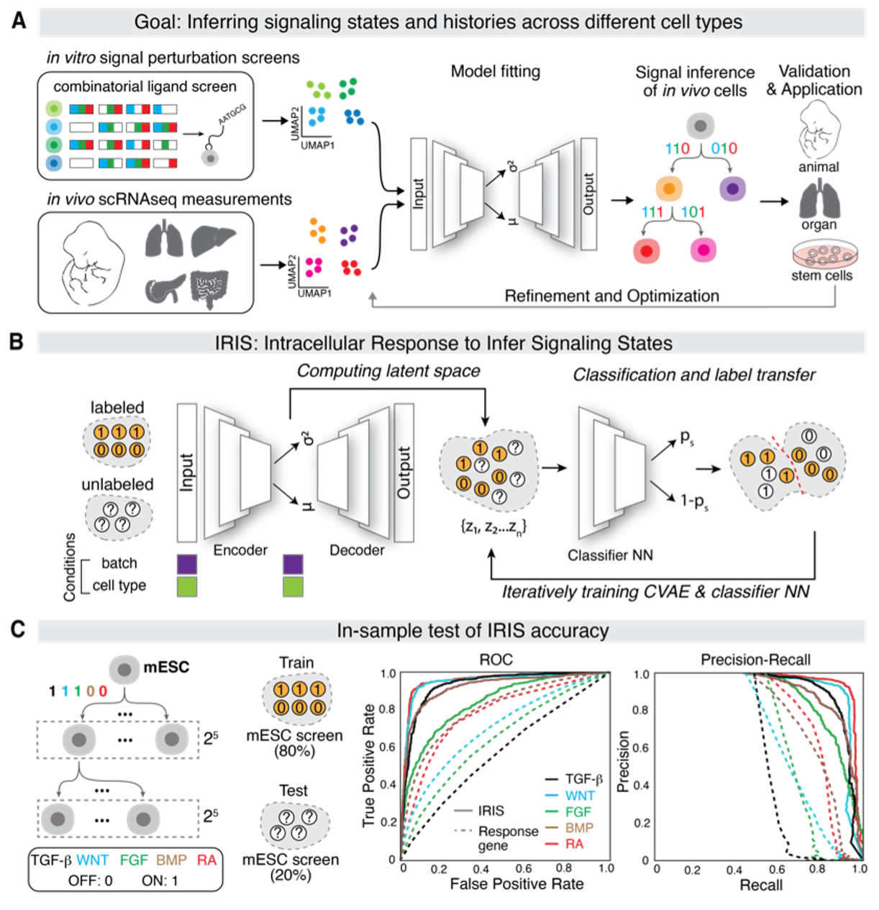

# IRIS-signaling-inference
Code repository for Hutchins et al. (2025) "Reconstructing signaling history of single cells via statistical inference". 



## Overview
IRIS is a set of algorithms and functionalities that analyze scRNA-seq data. IRIS can make predictions on cell signaling state by leveraging probabilistic models, generate and plot diffusion maps of cell types, and perform a collection of other kinds of analysis on the single-cell data. IRIS relies heavily on [AnnData](https://anndata.readthedocs.io/en/stable/) and [scvi-tools](https://scvi-tools.org/) - it expects data in the form of an AnnData object and uses SCVI and SCANVI models to make predictions. 

To use IRIS, you initialize an `IRIS` object, and call the various IRIS functionalities via `IRIS.<function>`. Each function in IRIS has a well-documented docstring that explains the expected inputs, any outputs, and generally what the function does. 

## System Requirements
### GPU Access
Since many components of IRIS leverage machine learning models, it is best to have access to a GPU so that model training and inference can be done more efficiently. If your computer does not come with a graphics card, we recommend running the machine learning methods of IRIS in a computing environment with access to a GPU. This code was tested through [jupyter notebooks](https://jupyter.org/) running on the Whitehead Institute compute cluster with Ubuntu 20.04, via a [SLURM](https://slurm.schedmd.com/documentation.html) job with access to an [NVIDIA RTX A6000 GPU](https://www.nvidia.com/en-us/design-visualization/rtx-a6000/). 

### Software 
There are several non-machine-learning methods in IRIS that can be run on a standard computer. IRIS has been tested on macOS and Linux, specifically:
* macOS: Sonoma (14.6.1)
* Linux: Ubuntu (20.04)

## Installation
[Create a Conda environment](https://docs.conda.io/projects/conda/en/latest/user-guide/tasks/manage-environments.html#creating-an-environment-with-commands) with Python=3.9, and activate the virtual environment:
```
conda create -n <my_env> python=3.9
conda activate <my_env>
```
Clone this repo:
```
git clone https://github.com/Pulin-Li-Lab/IRIS-signaling-inference.git
cd IRIS-signaling-inference
```
Install the other required packages:
```
pip install -r requirements.txt
```
[gseapy](https://pypi.org/project/gseapy/1.1.3/) may be able to be installed via `pip install gseapy` for Windows and M1/M2 Macs. Otherwise, follow these commands:
```
curl https://sh.rustup.rs -sSf | sh -s -- -y
export PATH="$PATH:$HOME/.cargo/bin"
pip install git+https://github.com/zqfang/gseapy.git#egg=gseapy
```
In total, the entire installation process should only take a few minutes.

## Usage
IRIS was primarily written to be imported as a module into a jupyter notebook (or similar), and called via `iris_obj.<function>`. You can view the example notebook [fig3+4.ipynb](https://github.com/Pulin-Li-Lab/IRIS-signaling-inference/blob/main/iris/examples/fig3%2B4.ipynb) for how to import and use IRIS from within this repo. 

Otherwise, make sure that whatever notebook you are trying to run is in the same directory as where you have cloned the `IRIS-signaling-inference repo`. At the top of the notebook, include these lines:
```
import sys
import os

# get the absolute path to the base directory
path = os.path.abspath(os.path.join(os.getcwd(), ".."))
sys.path.append(path)
```
and import IRIS via:
```
from IRIS_signaling_inference.iris.src.iris import IRIS
```
Then, you can create IRIS objects and use their functions! 
```
iris_obj = IRIS('test', anndata = data) # set anndata = your own data
iris_obj.response_gene() # for example
```
IRIS objects expect the obs of their corresponding Anndata objects to have a ground truth column for each pathway to be predicted, as well as columns 'celltype' and 'batch'. You can run `iris_obj.validate_adata(classes)` to check whether the Anndata has what IRIS expects, passing in a list of your ground truth column names (ex. ['RA_class',...]) for `classes`.

### Models
IRIS can both load in pretrained models and train models from scratch. Any time you want to load in a model for analysis, run `iris_obj.load_pretrained_model(paths, signals)` with the paths to the models you want to use for those particular signals. Otherwise, if you never run `load_pretrained_model` or set `iris_obj.models` to be empty, IRIS will create and train new models from scratch.

## Example
The example notebook [fig3+4.ipynb](https://github.com/Pulin-Li-Lab/IRIS-signaling-inference/blob/main/iris/examples/fig3%2B4.ipynb) uses IRIS to generate some of the plots used in Figures 3 and 4 in the paper, like panel C in the summary figure above. With a GPU, the notebook took about 10 minutes in total to run. Without a GPU, it may take around an hour on a standard computer. 

The IRIS class contains the necessary functions to re-create every figure in the paper, arranged roughly chronologically.

## Data
An h5ad data file can be made from this dataset: [GSE122009](https://www.ncbi.nlm.nih.gov/geo/query/acc.cgi?acc=GSE122009), and used in IRIS. A new single-cell dataset from this paper will also eventually be publicly available as a [NIH GEO dataset](https://www.ncbi.nlm.nih.gov/gds/?term=GSE289836). 
